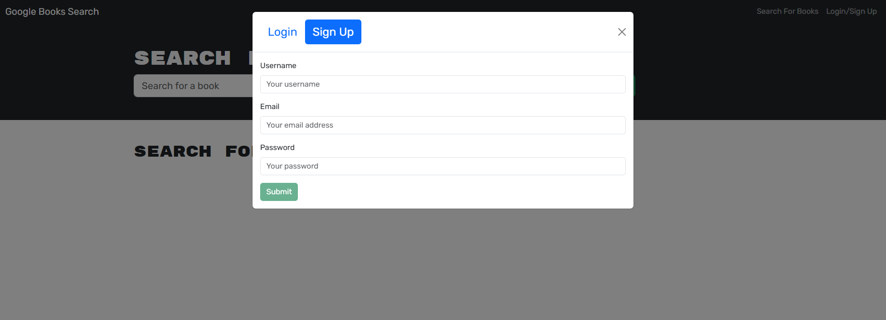

# iBook
 iBook is a MERN stack app featuring a Google Books API search engine, refactored from RESTful to GraphQL with Apollo Server. Users can search for and save books seamlessly.

  
  

## Description
 iBook is a MERN stack app featuring a Google Books API search engine, refactored from RESTful to GraphQL with Apollo Server. Users can search for and save books seamlessly.

## Table of Contents

- [iBook](#ibook)
  - [Description](#description)
  - [Table of Contents](#table-of-contents)
  - [Installation](#installation)
  - [Usage](#usage)
  - [Tests](#tests)
  - [License](#license)
  - [Contributing](#contributing)

## Installation

Heres a [Link](https://drive.google.com/file/d/1xi2nPvWCBrTdXrDoWHzAJo5vqzafGetr/view) to deployed application.

## Usage

Users can create an account to access additional features. Once registered, they can log in using their credentials to gain access to their personalized features.

On the home page, users can search for books using the search bar. Logged-in users have the added functionality to save books to their personal list or remove them as needed, enabling a customized experience.

## Tests

Application tested with noSQL MonogoDB and Apollo Server.

## License

This project is licensed under the MIT License.

## Contributing

Feel free to fork the repository and submit pull requests if you'd like to contribute!

Buy me a coffee? ☕
My contact info: parsamh8@gmail.com
